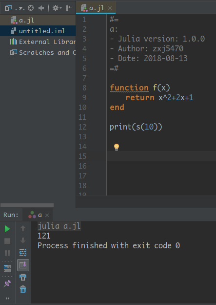
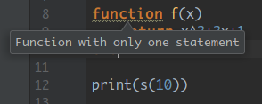
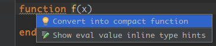
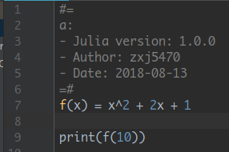
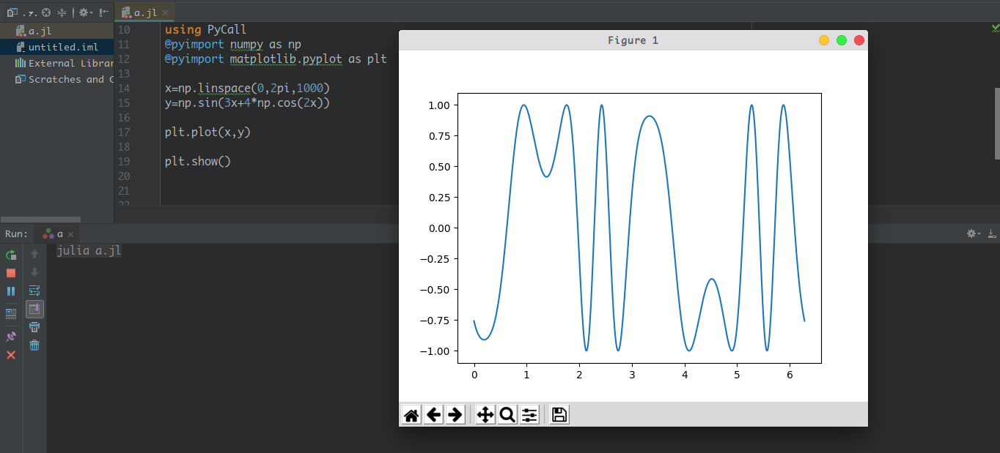

# Julia 1.0 简单入门函数 以及调用 Python

> 阅读本文大约需要 4 分钟。
> 
> 我当年就不应该在地铁上看到几百个人加群被吓一跳去开超级会员扩群。—— BennyHuo

## 包管理

由于 0.7 及 1.0 之后的安装包的API有所不同。Pkg不再是内置的全部变量，安装包需要手动using或者按 `]` 键进入pkg模式。

如果需要调用 Python 的 其他非 Conda 内置包（如 `matplotlib`，没错就是这家伙 ) ，由于新的包管理非常机智，
你还需要在 Julia 里面 **主动添加** Conda 这个包，而不是像以前那样直接`using`就行了。

比如你添加了 `IJulia` （依赖 `Conda`包），在 1.0 之后你就需要手动到去 Pkg里面添加 Conda，再通过 Conda.add 来添加 Python 的包。
当然了，要是像我这种连 add Conda 都不懒得打怎么办？去 Conda 目录下的 Python 中去 pip install matplotlib 下载对应的包也是可以的。

不过在 windows 下使用 Conda.add 添加 `matplotlib` 有一定可能会失败……不要问我为什么，我是在 Manjaro Deepin 下演示的。毕竟 Python 这种东西再怎么说 Linux 就是会比 Windows 方便啊。
当然这不是重点。大家满看一下就好了（

### pkg模式，按 ] 键进入

```julia
(v1.0) pkg> add PyCall
(v1.0) pkg> add Conda
```

###　再回到 REPL 模式，添加相应 package

```julia
julia> using Pkg
julia> Pkg.add("PyCall")
julia> Pkg.add("Conda")

julia> using Conda
julia> Conda.add("matplotlib")
```

总之是为了能够让 `PyCall` 调用。
然后使用

```julia
using PyCall
@pyimport numpy as np
# 调用python 生成 从 1 到 10 的 10个数
x = np.linspace(1,10,10)
```

打印出的ｘ是这样的：

```julia
10-element Array{Float64,1}:
  1.0
  2.0
  3.0
  4.0
  5.0
  6.0
  7.0
  8.0
  9.0
 10.0
```

此时　x 为 Julia 中的 `Float` 类型数组

这意味着什么？互操作啊！
我调用了 Python 的函数，居然能返回一个 Julia 的数组，讲究。
那我们接下来就可以来搞事情了。

## Julia 函数

我们知道，Julia 里面语法有一个很好玩的地方，就是可以用`数学表达式`的样子来表示 **代码** 的`表达式`。

说起来好像有点绕，看下面的那个例子就好了。

- 在其他语言里面一般 `^`符号都是表达位运算符号的，Julia 里面是乘方，这“非常直观”。
- 在一些算法里面我们往往需要用到乘法、乘方什么的，系数×变量之类的，在 Julia 里面怎么玩呢？直接写就可以了。举个例子：



没错，这就是表示 $x^2+2x+1$ 。我这里用的 LaTeX 写出来的内容就是 `$ x^2+2x+1 $`，可以说是非常数学友好了。

另外这里为了新手方便我这里写了 return，事实上 Julia 的函数在不写 return 时默认返回最后一个语句。也就是说我们可以写成这样

```julia
function f(x::Int)
    x^2+2x+1
end
```

当然了眼尖的朋友可能就发现了，上面那张截图有黄色的波浪线，十分碍眼。我们可以看一下这里写了什么：


`Function with only one statement` 函数只有一条表达式。为什么会有这么一条提示呢？
因为 Julia 有着更为简便的写法啊！

如果你的 “函数” 比较简单，那么我们可以在 JB 的 IDE 中使用 quick fix 功能，按 <kbd>alt+Enter</kbd> 键后出现转换成 compact function.


什么是 `compact function`？我们先看看我们把回车按下去后，上面的东西变成了什么：


完美～

回到一开始的调用 Python 来.

我们就可以写成这样

```julia
using PyCall
@pyimport numpy as np
@pyimport matplotlib.pyplot as plt

x=np.linspace(0,2pi,1000)
y=np.sin(3x+4*np.cos(2x))

plt.plot(x,y)
plt.show()
```

调用成功



## 最后

我们学会了什么：

- compact function 玩法
- 调用PyCall
- 知道了JB全家桶上有这么一个十分嗨的插件(｡･∀･)ﾉﾞ

特别感谢 @考古学家千里冰封 的 [ice1000/julia-intellij](https://github.com/ice1000/julia-intellij) 插件提供IDEA、PyCharm 等 IDE 上 Julia 的支持。

### 参考资料

- [PyCall](https://github.com/JuliaPy/PyCall.jl)
- [在Julia语言中调用Python - aliyun](https://www.aliyun.com/jiaocheng/490935.html)
- [在Julia语言中调用Python函数 - mamicode](http://www.mamicode.com/info-detail-285599.html)